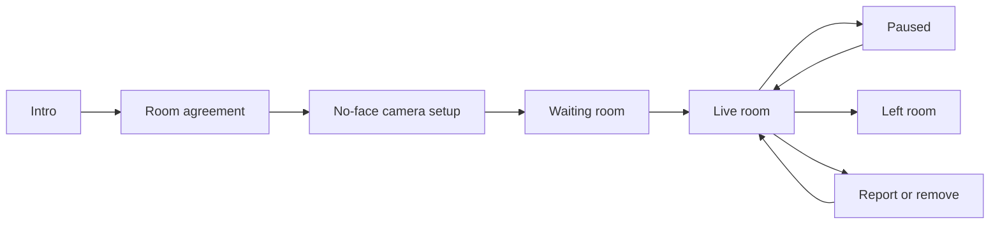

# Room Model

## Goal

Define the product states before the interface gets redesigned. The room should feel predictable, private, and easy to leave.

## Main Flow

## States

| State | Purpose | Required decisions |
| --- | --- | --- |
| Intro | Explain why the project exists. | Adult context, no-face default, no ranking, no DMs. |
| Room agreement | Make safety explicit before entry. | 18+, consent, no minors, no faces, no contact exchange, no recording. |
| No-face camera setup | Let people test framing before joining. | Camera on/off, face guard, local-only preview, no mic request. |
| Waiting room | Prepare connection and host controls. | Room capacity, witness policy, admit/remove/lock. |
| Live room | Shared presence. | 20 equal windows, silent status, pause/leave/report always visible. |
| Paused | Participant stays present while hidden. | Camera stops, tile shows paused, resume is deliberate. |
| Left room | Interaction ends cleanly. | Stop tracks, close peer connections, clear transient state. |
| Report or remove | Safety response. | Reason, evidence metadata, immediate local hide/remove. |

## Roles

- **Host:** can create a room, lock it, admit/remove people, set witness policy, and end the room.
- **Visible participant:** camera on, face out of frame, silent, equal tile.
- **Paused participant:** camera hidden, still counted in the room.
- **Witness:** no camera, silent, only allowed when the room policy permits it.

## Room Limits

- Target visual capacity: 20 equal windows.
- Mobile should show a moving window through the room, not shrink everyone into unusable thumbnails.
- The client should render visible and near-visible tiles first. Off-screen video should be paused, lowered, or detached where possible.
- No tile should become larger because of attractiveness, activity, tips, likes, or host preference.

## Safety State

Safety controls are not a separate mode. They are always available:

- pause and hide me
- leave
- report contact exchange
- report recording concern
- report suspected minor
- report harassment
- report consent concern

## Design Implications

- The room should not feel like a performance stage.
- Controls should be low-pressure and obvious.
- “No face expected” should feel normal, not punitive.
- Witness mode must be visibly different from visible participation.
- Host tools should feel protective, not managerial or police-like.
