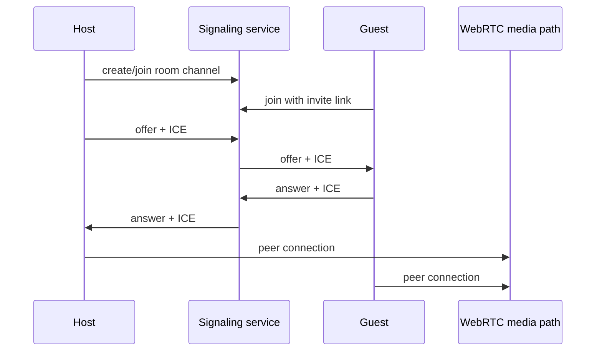

# Signaling Plan

## Current State

The prototype now has two signaling paths:

1. an automatic local room bridge using `BroadcastChannel` for same-origin alpha testing
2. the older manual WebRTC offer/answer copy-paste fallback for debugging direct media

The automatic bridge proves the app can support a real host queue, invite-link join flow, and room state without forcing users to exchange raw SDP text. It is still local-only and not a production signaling service.

## Target

Invite links should connect people without manual signal exchange:

1. Host creates a link room.
2. Guest opens the link.
3. Both clients join a short-lived signaling channel for that room.
4. Clients exchange WebRTC offers, answers, and ICE candidates through the signaling channel.
5. Media flows peer-to-peer when possible.
6. If direct peer-to-peer fails, a TURN relay may be offered with an explicit privacy status.

## What Signaling May Carry

- room id
- ephemeral participant id
- role: host, visible participant, paused participant, witness
- WebRTC offer/answer descriptions
- ICE candidates
- join/leave/pause status
- host moderation events

## What Signaling Must Not Carry

- media streams
- chat messages
- DMs
- contact details
- public profiles
- permanent user identity
- adult activity metadata beyond what is needed for safety and abuse response

## Recommended Architecture

## Service Requirements

- WebSocket or realtime channel per room.
- Room state expires automatically.
- No message history after room end.
- Rate limits per IP/session.
- Host can remove a participant from the signaling channel.
- Room can be locked.
- Events are structured, validated, and versioned.
- No server-side media handling in the first signaling phase.

## Privacy Honesty

Peer-to-peer can expose participant IP addresses to each other. TURN relay can hide peer IPs from each other but creates infrastructure cost and changes the privacy model. The UI must show which mode is active.

## Implementation Phases

1. Keep manual P2P as a fallback for development.
2. Keep the local alpha bridge until the room state model is stable.
3. Replace the local bridge with link-room WebSocket signaling.
4. Preserve host admit/remove/lock events in the server version.
5. Add TURN support only after the UI can explain relay mode honestly.
6. Add abuse controls and age strategy before public discovery or large public rooms.
